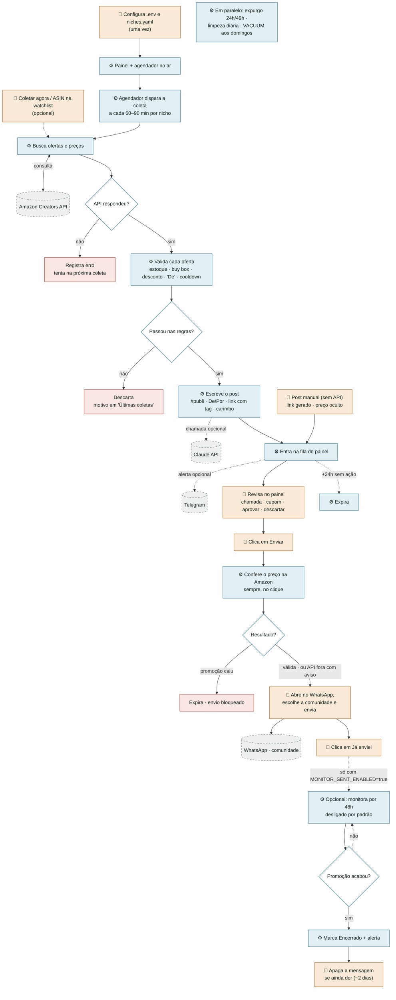

# Fluxograma do Promo Radar (v1.1)

O preço é conferido na Amazon no instante do envio, então o post só sai enquanto a promoção está ativa. O acompanhamento depois do envio vem desligado.

Legenda: **azul = automático (sistema)** · **laranja = manual (você)** · **cinza tracejado = serviço externo** · **vermelho = fim do caminho**.
Versão visual completa (abre no navegador): [`docs/fluxograma.html`](docs/fluxograma.html).

## Quem faz o quê

| Etapa | Quem | Quando |
|---|---|---|
| Configurar senha, tag, credenciais e nichos | Você | uma vez |
| Buscar ofertas na Amazon (busca por nicho + watchlist) | Sistema | a cada 60–90 min |
| Validar desconto, estoque, buy box, "De" e repetição | Sistema | a cada coleta |
| Escrever o post (#publi, De/Por, link, carimbo) | Sistema | a cada coleta |
| Avisar que há post novo | Sistema | dentro da janela do nicho |
| Revisar (chamada, cupom, aprovar, descartar) | Você | quando quiser |
| Conferir o preço na Amazon antes de liberar o link | Sistema | sempre, no clique |
| Escolher a comunidade e enviar no WhatsApp | Você | 1 clique por post |
| Confirmar "Já enviei" | Você | após enviar |
| Monitorar a oferta e alertar quando acabar *(desligado por padrão)* | Sistema | a cada 1h, por 48h |
| Apagar a mensagem de promoção encerrada *(só com o monitor ligado)* | Você | até ~2 dias |
| Expirar fila velha, expurgar conteúdo, limpar banco | Sistema | 30 min · 1h · diário |
