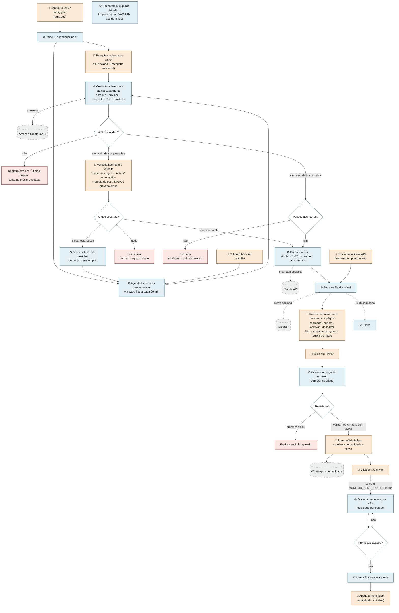

# Fluxograma do Promo Radar (v1.4)

Agora tudo gira em torno da **barra de pesquisa**: você digita um termo ("teclado", "mochila"), vê o resultado já avaliado e escolhe o que entra na fila. Uma busca que você salva passa a rodar sozinha. O preço é conferido na Amazon no instante do envio, então o post só sai enquanto a promoção está ativa. O acompanhamento depois do envio vem desligado.

Legenda: **azul = automático (sistema)** · **laranja = manual (você)** · **cinza tracejado = serviço externo** · **vermelho = fim do caminho**.
Versão visual completa (abre no navegador): [`docs/fluxograma.html`](docs/fluxograma.html).

## Quem faz o quê

| Etapa | Quem | Quando |
|---|---|---|
| Configurar senha, tag, credenciais e as regras do `config.yaml` | Você | uma vez |
| **Pesquisar um termo na barra** e escolher o que entra na fila | Você | quando quiser |
| Avaliar cada oferta da pesquisa e mostrar o veredito + prévia | Sistema | na hora da pesquisa |
| Rodar as **buscas salvas** e a watchlist | Sistema | a cada 60 min (`saved_search_every_minutes`) |
| Validar desconto, estoque, buy box, "De" e repetição | Sistema | em toda busca |
| Escrever o post (#publi, De/Por, link, carimbo) | Sistema | ao entrar na fila |
| Avisar que há post novo | Sistema | dentro da `posting_window` |
| Revisar (chamada, cupom, aprovar, descartar) — sem recarregar a página | Você | quando quiser |
| Filtrar a fila pelos 19 departamentos do site ou por texto | Você | quando quiser |
| Conferir o preço na Amazon antes de liberar o link | Sistema | sempre, no clique |
| Escolher a comunidade e enviar no WhatsApp | Você | 1 clique por post |
| Confirmar "Já enviei" | Você | após enviar |
| Monitorar a oferta e alertar quando acabar *(desligado por padrão)* | Sistema | a cada 1h, por 48h |
| Apagar a mensagem de promoção encerrada *(só com o monitor ligado)* | Você | até ~2 dias |
| Expirar fila velha, expurgar conteúdo, limpar banco | Sistema | 30 min · 1h · diário |

## O que mudou em relação à v1.1

| Antes (nicho) | Agora (busca) |
|---|---|
| Lista fixa de nichos no `niches.yaml`, cada um com suas buscas e filtros | Um `config.yaml` só, com as regras valendo para tudo |
| O sistema coletava sozinho e você descobria o que ele achou | Você **pesquisa**, vê o resultado avaliado e decide item a item |
| Categorias inventadas que não existem no amazon.com.br | Os **19 departamentos do menu do site**, com o departamento vindo do próprio produto (`browseNodeInfo`) |
| Nenhuma forma de procurar algo pontual | Barra de pesquisa: "teclado", "mochila", "headset gamer" |
| Botão "Coletar agora" | "Salvar esta busca" (roda sozinha) + "Rodar buscas salvas" (força a rodada) |
